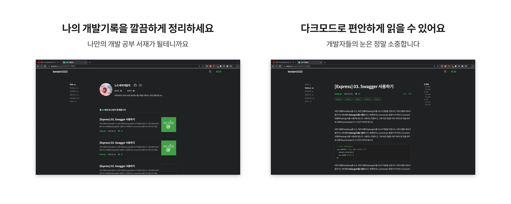
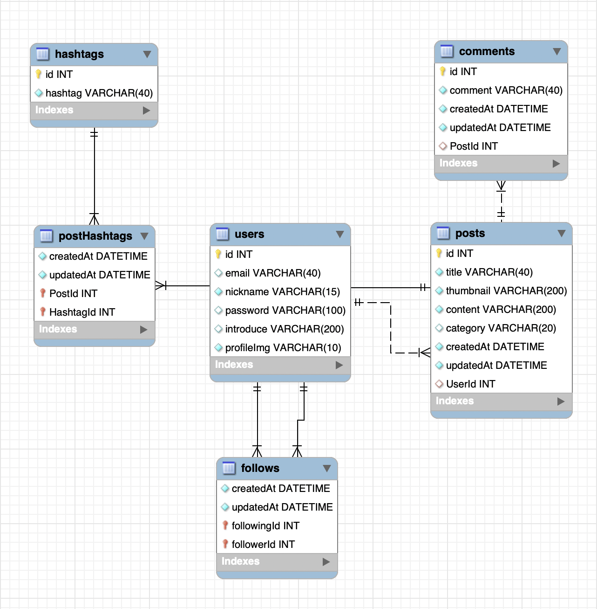
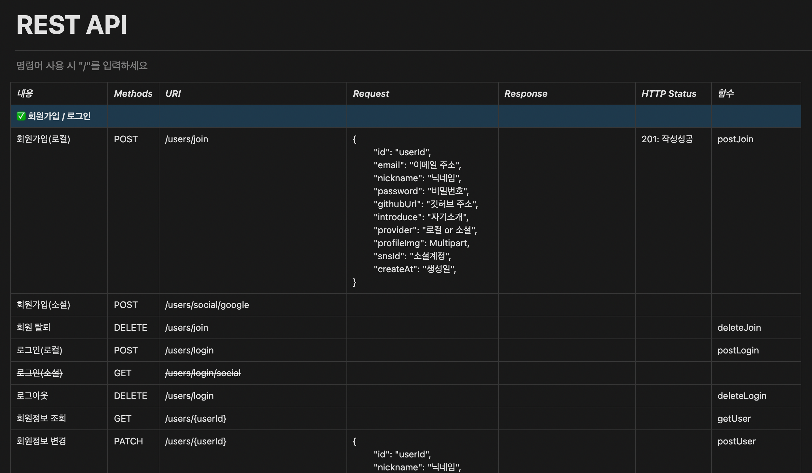

# ㅂㄹㄱ : 블로그 제작 웹 서비스

> *해당 포트폴리오에는 Back-End 내용만 들어있습니다.*
> 

## *OUTLINE.*


이번 프로젝트의 목적은 **Back-End 포지션의 전반적인 작업을 직접 제작해보는 것**이였습니다. 

```xml
▪︎ Web Application을 제작할 때 전체 작업의 순서는 어떻게 되는지?
▪︎ 개발 시, Front-End와 협업은 어떻게 진행 하는지?
▪︎ DB 스키마는 해당 프로젝트에 맞게 어떻게 짜면 되는지?
▪︎ API는 명세서는 어떻게 작성하면 되는지? 등등
```



[ 최종 결과물 시안 ]

<br>

## *MEMBERS & ROLE.*

| ROLE | NAME | WORK |
| --- | --- | --- |
| 서비스 기획 | 이권석(main), 한광재(sub) | 아이디어 구상, 밴치마킹 |
| 디자인 | 이권석(main) | Concept, Wireframe, UX/UI, Prototype |
| Front-End | 한광재(main) | Front 설계 |
| Back-End | 이권석(main) | Server, Database 설계 |

<br>

## *Back-End ROLE.*

| 업무 | SKILL SET & TOOL | 진행 상황 |
| --- | --- | --- |
| Database 설계 | MySQL(RDBMS) | ✅ 진행 중 |
| Web Application 설계 | ExpressJS, Sequelize ORM | ✅ 진행 중 |
| RESTFul API 설계 및 명세 | ExpressJS, Notion | ✅ 진행 중 |
| Client - Server Connect | CORS | ✅ 진행 중 |
| 배포 | AWS EC2 | ✅ 진행 중 |
| WEB Server 구축 | NginX | 🔄 대기 중 |
| Container 관리 | Docker | 🔄 대기 중 |

<br>

### 1) Database 설계

블로그 서비스 특성상, 모든 데이터들을 정해진 틀(스키마)에 맞춰 관리하는 것이 좋을꺼 같아서 관계형 DB인 SQL을 사용했습니다. 
관계형 SQL 중 MySQL을 사용한 이유는 가장 점유율이 높은 SQL이기 때문이였습니다.
IT에서 TOOL의 점유율은 중요하다고 배웠습니다. (점유율 ▲  →  업데이트 ▲)
DB 스키마는 다음과 같이 구조를 짰습니다. 

| Table | Relation | Explain | Mapping Table |
| --- | --- | --- | --- |
| User : Post | 1:N | 해당 유저(User)에는 여러 포스트(Post) 존재. | - |
| Post : Comment | 1:N | 한 포스트에는 여러 댓글(Comment) 존재. | - |
| User(A) : User(B) | N:M | 팔로워 팔로잉 기능 | follows |
| Post : Hashtag | N:M | 포스트에 해시태그 넣는 기능 | postHashtags |

<br>



Database CRUD는 Sequelize ORM을 이용했습니다.

<br>

### 2) RESTFul API 설계 & 명세

Client와 통신(Request, Response)을 위해 RESTful API 형식으로 설계했습니다.
Front-End 개발자와 의견을 조율하며 ‘Notion’ 으로 정리하여 지속적으로 피드백하며 진행하였습니다.
도메인 기준으로 Controller, Router, Middleware 등 분리시켜 작업을 진행하였습니다.

```xml
▪︎ 해당 내용은 어떤 HTTP Method 를 사용할 것인지
▪︎ 요청과 응답에 어떤 정보를 넣을것인지
▪︎ URI 명은 어떤 규칙으로 정할 것인지
▪︎ 함수 명은 어떤 규칙으로 정할 것인지 등등
```



<br>

## *NEXT STEP.*


보시다시피 해당 프로젝트는 아직 미완성입니다. 
***웹 서버 설계, 배포, CORS, 테스팅***  등 해야 되는 작업이 많이 남아있습니다.
하지만 지금까지 해왔던 과정에서 프론트와 어떤식으로 협업하는 것이 좋은지, 
백엔드로서 부족했던 CS, Skill 등이 무엇인지 알게 되었습니다.

```xml
▪︎ Client, Server  http 통신
▪︎ ORM 이용 Application, DB 연결
▪︎ 미들웨어, 라우터, 컨트롤러 등 모듈화 설계방식
```

지금도 Stackoverflow, 공식문서, 기술블로그, 도서 등 뒤져 가며 채워나가고 있습니다.
지금도 부족하고 앞으로도 부족하지만 꾸준히 공부하여 **지속적으로 프로젝트를 진행할 것**입니다.